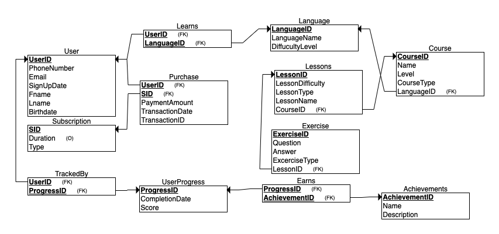

# Duolingo--BSAD-384

# Problem Statement

In the digital education space, personalized language learning platforms must efficiently manage user interactions, progress tracking, course offerings, and subscription models. A well-structured database system is crucial for maintaining relationships between users, courses, lessons, exercises, achievements, and subscription payments. The system should facilitate smooth interactions between users and learning content, track their progress, and support multiple languages with different difficulty levels. Additionally, it should accommodate various course types, exercise formats, and achievement tracking to enhance user engagement. The goal is to develop a robust data structure that allows for scalable and efficient language learning experiences while maintaining data integrity and ease of access.

# ER Model


# Relational Model 



# Source Code

* [Create Script (DDL)](createtable)
* [Populate Script (DML)](Populate)

## Sample Queries

 
### Query 1

Which languages are users learning?

```
 SELECT U.Fname, U.Lname, L.LanguageName
FROM Users AS U
JOIN Learns AS LR ON U.UserID = LR.UserID
JOIN Language AS L ON LR.LanguageID = LR.LanguageID;
```

### Query 2

What are the names and levels of all courses?

```
SELECT C.Name AS CourseName, C.Level
FROM Course AS C;
 ```

### Query 3

What are the full names of users and their signup dates?

```
SELECT 
U.Fname + ' ' + U.Lname AS FullName,  -- Derived field: FullName
U.SignUpDate
FROM Users AS U;
 ```

### Query 4

What is the total number of users?

```
SELECT 
SELECT COUNT(U.UserID) AS NumberOfUsers
FROM Users AS U;
 ```

### Query 5

What are the names of the lessons and their corresponding courses?

```
SELECT L.LessonName, C.Name AS CourseName
FROM Lessons AS L
JOIN Course AS C ON L.CourseID = C.CourseID;
 ```
